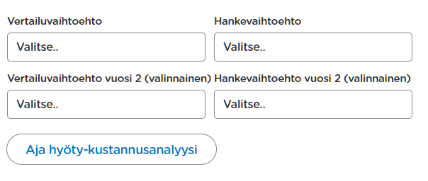

# Vaikutusten arviointi

Vaikutusten arviointi nojaa usein Väyläviraston ylläpitämään [hankearviointiohjeistukseen](https://vayla.fi/suunnittelu/hankkeiden-suunnittelu/vaikutusten-arviointi/liikennevaylat) siinä, millaisia oletuksia voidaan tehdä. Edellä mainittujen ohjeiden noudattaminen on usein myös edellytys arvioinneissa, joissa valtio on mukana kumppanina tai joita valtio hyödyntää päätöksenteossaan. Myös useimmat liikennejärjestelmävertailut pohjautuvat hankearviointiohjeiden mittareihin, vaikka niitä hyödyntäisivät vain kuntatoimijat. 

Arvioinneissa ei ennakoida tulevaisuuden poliittisia päätöksiä esimerkiksi eri kulkutapojen hinnoittelun tai priorisoinnin osalta. Yhteiset oletukset tulevaisuudesta mahdollistavat eri hankkeiden ja politiikkatoimenpiteiden vaikuttavuuden vertailtavuuden. Toisaalta strategiatyössä poliittiset päätökset sekä liikennehankkeista että muista toimenpiteistä kuten liikenteen ja pysäköinnin hinnoittelusta ovat tavoitteiden saavuttamisen välineitä. Tällöin tarvitaan skenaariotarkasteluita hankkeiden ja muiden politiikkatoimenpiteiden yhdistelmillä.

## Hyöty/kustannuslaskennan-työkalu

HELMET-mallin käyttöliittymässä on mukana H/K-laskelmatyökalu, joka auttaa tuottamaan hankearvioinneissa käytettäviä vertailulaskelmia. Työkalulla voidaan verrata ajettujen skenaarioiden hyötyjä ja kustannuksia. Analyysia varten on määriteltävä:

1. Vertailuvaihtoehdon (ve0) tuloskansio (`Tulosten tallennuspolku\Skenaarion nimi`)
2. Hankevaihtoehdon (ve1) tuloskansio 

Jos ennusteita on ajettu kahdelle vuodelle (esim. 2040 ja 2060), vertailuvaihtoehto ja hankevaihtoehto on mahdollista määrittää toisellekin ennustevuodelle.

Työkalu tuottaa Excel-tiedoston, joka tallennetaan samaan kansioon, jossa vertailuvaihtoehdon tuloskansio sijaitsee. Excel tiedoston etusivulla on esitäytetty H/K laskelma, johon on käsin lisättävä hankkeen kustannukset, jotta lopullinen H/K laskelma voidaan tehdä. Excel-tiedoston muilla välilehdillä on mallin tuottamat tiedot, sekä yksikköarvot, joiden avulla yhteiskuntataloudelliset hyödyt lasketaan. Hankearviointeja tehtäessä on varmistettava, että yksikköarvot ovat ajantasaiset ja oikean vuoden hintatasossa. 